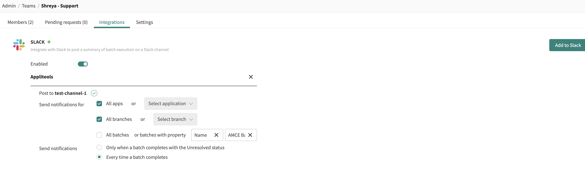
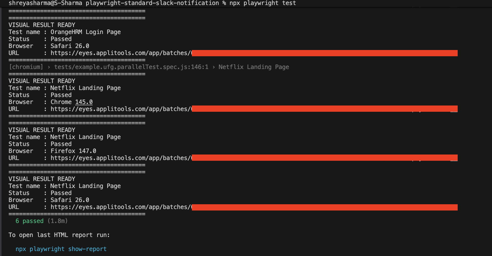
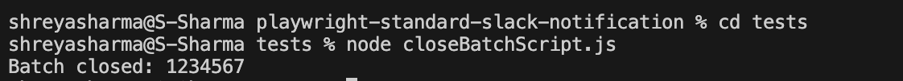

Eyes Playwright Standard ( Without Fixtures )

Pre-requisite
(1) set environment variable
APPLITOOLS_BATCH_ID = <custom_batch_id>
APPLITOOLS_API_KEY = <applitools_api_key>
APPLITOOLS_DONT_CLOSE_BATCHES=true

Make sure you have added slack/teams integration

Execute 
(1) npx playwright test
(2) node closeBatchScript.js

### Output 
Slack

Teams

Applitools Dashboard

Reference
(1) https://applitools.com/docs/eyes/sdks/playwright-ts-standard/batch-close